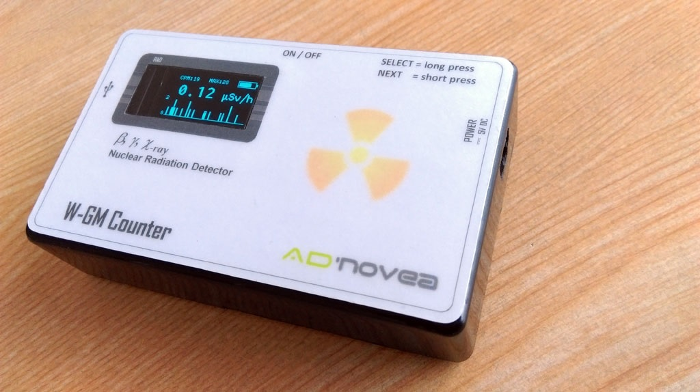

#W-GM Counter 
by AdNovea (c)2018

**************************************************************************************
W-GM Counter is a very low cost DIY Wifi Geiger-Müller counter (radioactivity).

The overall A-GM project is aimed for providing a long-term continuous measurement of the radioactivity level. It is made of an open-source Web application running on a SOHO server (e.g. QNAP sells Small Office Home Office servers) connected to a W-GM Counter device, C-GM Counter device or a compatible GMC-320 Geiger-Muller Counters from GQ Electronics LLC. Other compatible or DIY Geiger-Muller counters could also be used.  This project has been developed and is provided AS IS by AdNovea®.

See also:

**A-GM Manager:** - A web application for long-term continuously monitoring and storing on local servers the Beta/Gamma radiation levels acquired from Geiger-Muller Counters.
(https://sourceforge.net/projects/a-gm-manager/)

**C-CGM Counter:** - Connected Geiger-Müller device (counter) hardware and firmware for recording radioactivity levels compatible with A-GM Manager. (https://sourceforge.net/projects/c-gm-counter/)

**W-GM Counter:** - Wifi, battery powered Geiger-Müller device (counter) hardware and firmware for recording radioactivity levels compatible with A-GM Manager. (https://sourceforge.net/projects/w-gm-counter/)

**************************************************************************************
 
 
 
**DEVICE SPECIFICATIONS (preliminary)**

 - 	Radiation detection : beta, gamma, X-ray
 - 	GM tube : STS-5 (CTC-5) / SBM-20  (400 V operating voltage)
 - 	Language support : English only
 - 	Maximum value 65 535 CPM / 425 µSv/h (theoretical)
 - 	Display values : Current CPM, Current µSv/h, Maximum µSv/h since startup, Average µSv/h since startup, Elapsed time since startup, one minute history, Level on bar graph
 - 	Alarm: User defined threshold, Alarm messages on LCD
 - 	Audio sound: Beep for each beta/gamma radiation pulse, Audible sound alarm
 - 	Device control from : Device internal menu, USB (require a serial console such as Termite) or Wifi (using a web browser)
 - 	Network connection using DHCP
 - 	Support for A-GM Manager web interface
 - 	User defined parameters (from Menu or through web interface)
 - 	GM tube conversion factor (CPM to µSv/h): Alarm threshold in CPM, Buzzer On or Off, Display timeout, Enable Network for communication to A-GM Manager, A-GM server IP definition (through USB or A-GM Manager), Internal H.V. voltmeter calibration  (through USB or A-GM Manager), 
 -  Connect to A-GM Manager for storing data and graphic display.
 -  Parameters can be permanently saved into EEPROM
 -  Lipo 3.7V battery powered with integrated recharging circuit

 Physical Parameters:

 -  WIFI 802.11b/g/n and USB ports
 - 	Size (W:100 x H:60 x D:25mm) : 	
 - 	Net weight with battery: ca 95g	
 - 	Power: 	5V DC pack (~2Watts)
 -  Interface: English only

**BUILDING the W-GM Counter device**

*Read the W-GM.PDF file*

 **************************************************************************************

**FILES**

 -  W-GM.pdf : User manual (with building instructions)
 -  WGM_1.x.bin : Firmware for ESP32 (Heltec Wifi kit32 module)

 **************************************************************************************

**VERSIONS**

 -  **1.1.0** 02-12-2018  official release for ESP-32
 -  **1.0.0** 20-10-2018  pre-release for ESP-32

**************************************************************************************